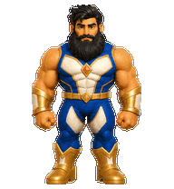
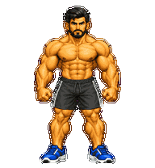
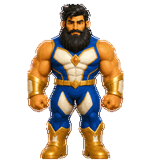
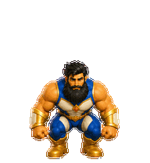
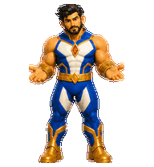
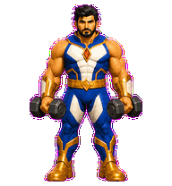
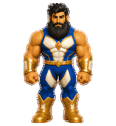
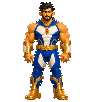
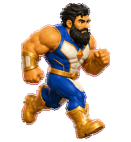
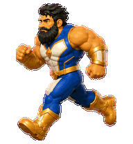

# Klaus — Codex Pet Superman

<p align="center">
  
</p>

<p align="center">
  <strong>Your Superman! 💪🏻</strong><br>
  Calm confidence, sharp focus, and a warm protective spirit.
</p>

Klaus is a custom animated pet for Codex. He stays calm while you think, gets moving when work begins, and brings a little superhero energy to every task.

## Costume collection

The same Klaus, with his black hair, beard, and powerful bodybuilder physique, in three additional outfits. Each outfit is a separate Codex Pet v2 package with nine animations and sixteen look directions.

<table align="center">
  <tr>
    <td align="center"><br><strong>健身休闲 · Fitness</strong><br>Bare chest, athletic shorts, and trainers.</td>
    <td align="center"><br><strong>西装革履 · Suit</strong><br>Tailored navy suit, white shirt, and tie.</td>
    <td align="center"><br><strong>海滩度假 · Beach</strong><br>Open tropical shirt, beach shorts, and sandals.</td>
  </tr>
</table>

Packages: [Fitness](pets/klaus-fitness/), [Suit](pets/klaus-suit/), [Beach](pets/klaus-beach/). Each includes animation previews and a labeled contact sheet for inspection.

## Animations

<table align="center">
  <tr>
    <td align="center"><br><strong>Waving</strong></td>
    <td align="center"><br><strong>Jumping</strong></td>
    <td align="center"><br><strong>Waiting</strong></td>
  </tr>
  <tr>
    <td align="center"><br><strong>Working</strong></td>
    <td align="center"><br><strong>Reviewing</strong></td>
    <td align="center"><br><strong>Oops!</strong></td>
  </tr>
</table>

### On the move

<p align="center">
  
  
</p>

## Install

Clone this repository into your Codex pets directory:

```bash
git clone git@github.com:Bosn/CodexPetSuperman.git ~/.codex/pets/klaus
```

If the directory already exists, update it instead:

```bash
cd ~/.codex/pets/klaus
git pull
```

Then restart Codex if Klaus does not appear immediately.

### Install the three additional outfits

From this repository, copy the three packages into your Codex pets directory:

```bash
mkdir -p ~/.codex/pets
for pet in klaus-fitness klaus-suit klaus-beach; do
  if [ -e "$HOME/.codex/pets/$pet" ]; then
    echo "Already installed; skipped: $pet"
  else
    cp -R "pets/$pet" "$HOME/.codex/pets/$pet"
  fi
done
```

Each appears separately in the pet picker under its Chinese outfit name. Restart Codex if the new entries do not appear immediately.

## Pet package

- `pet.json` — pet identity and Codex sprite configuration
- `spritesheet.webp` — complete v2 animation atlas
- `images/` — GIF previews used by this README
- `pets/klaus-{fitness,suit,beach}/` — additional outfits, each with its own manifest, atlas, previews, and QA artifacts

Klaus uses the Codex Pet v2 spritesheet format.
