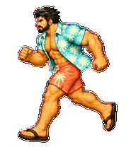
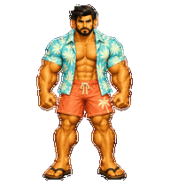
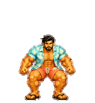
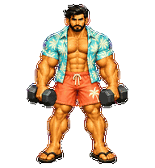
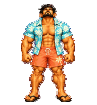

# Klaus · 海滩度假

同一位 Klaus，敞开热带短袖衬衫、沙滩短裤与凉鞋，保留强壮肌肉。

Same Klaus face, black hair, beard, and bodybuilder physique in a new outfit.

## Animations

| Idle | Moving right | Moving left |
| --- | --- | --- |
|  |  |  |

| Waving | Jumping | Oops |
| --- | --- | --- |
|  |  |  |

| Waiting | Working | Reviewing |
| --- | --- | --- |
|  |  |  |

## Looking around

## Package and validation

- Codex Pet v2; 1536 x 2288 atlas with 192 x 208 cells.
- Nine complete animations and sixteen clockwise gaze directions; 73 populated frames.
- Atlas, transparency, edge cleanup, three independent blind reviewers, and independent visual QA passed.
- Minor intermediate-angle similarities are recorded in the [QA summary](qa/summary.json).
- [Full contact sheet](qa/contact-sheet.png), [labeled gaze sheet](qa/look-directions.png), [generation specifications](qa/generation-prompts.json).

Install this folder as ~/.codex/pets/klaus-beach, with pet.json and spritesheet.webp together. See the [installation guide](../../README.md#install-the-three-additional-outfits).
